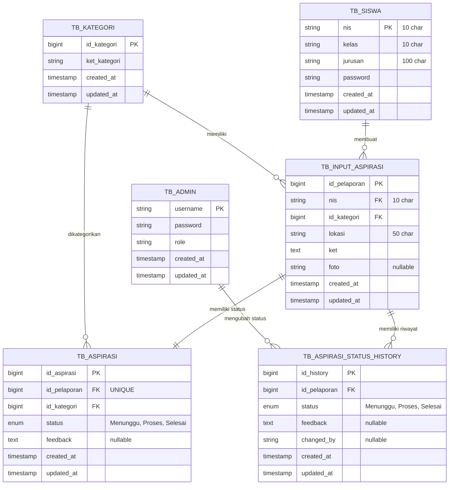

# Entity Relationship Diagram (ERD) - Aspirasi Web
## Updated: 24 Februari 2026

## Diagram ERD



---

## Perubahan dari Versi Sebelumnya

### ❌ Dihapus:
- `TB_SISWA.nama` - Field nama siswa dihapus untuk privasi

### ✅ Ditambahkan:
- `TB_ASPIRASI.id_pelaporan` - Relasi one-to-one dengan TB_INPUT_ASPIRASI
- UNIQUE constraint pada `TB_ASPIRASI.id_pelaporan`

### 🔄 Diubah:
- Relasi TB_ASPIRASI sekarang one-to-one dengan TB_INPUT_ASPIRASI (bukan TB_KATEGORI)
- Setiap aspirasi memiliki status aspirasi sendiri

---

## Level 1: Conceptual ERD

### Entitas Utama:
1. **Admin** - Pengelola sistem
2. **Kategori** - Jenis kerusakan/masalah
3. **Siswa** - Pelapor aspirasi (identifikasi hanya dengan NIS)
4. **Input Aspirasi** - Data aspirasi
5. **Aspirasi** - Status aspirasi (per aspirasi)
6. **Aspirasi Status History** - Riwayat perubahan status

### Relasi:
- Admin mengelola status aspirasi
- Siswa membuat aspirasi
- aspirasi dikategorikan berdasarkan kategori
- **Setiap aspirasi memiliki satu status aspirasi** (one-to-one)
- Setiap aspirasi memiliki riwayat perubahan status

---

## Level 2: Logical ERD

### TB_ADMIN
**Primary Key:** username
- username (string, unique)
- password (string, hashed)
- role (string: 'admin')
- timestamps

**Relasi:**
- One-to-Many dengan TB_ASPIRASI_STATUS_HISTORY (melalui changed_by)

---

### TB_KATEGORI
**Primary Key:** id_kategori
- id_kategori (bigint, auto increment)
- ket_kategori (string, max 100)
- timestamps

**Relasi:**
- One-to-Many dengan TB_INPUT_ASPIRASI
- One-to-Many dengan TB_ASPIRASI

---

### TB_SISWA
**Primary Key:** nis
- nis (string, max 10, unique)
- kelas (string, max 10)
- jurusan (string, max 100)
- password (string, hashed)
- timestamps

**Relasi:**
- One-to-Many dengan TB_INPUT_ASPIRASI

**Catatan:** Field `nama` telah dihapus untuk privasi siswa. Identifikasi hanya menggunakan NIS.

---

### TB_INPUT_ASPIRASI
**Primary Key:** id_pelaporan
- id_pelaporan (bigint, auto increment)
- nis (foreign key → TB_SISWA.nis)
- id_kategori (foreign key → TB_KATEGORI.id_kategori)
- lokasi (string, max 50)
- ket (text)
- foto (string, nullable)
- timestamps

**Relasi:**
- Many-to-One dengan TB_SISWA
- Many-to-One dengan TB_KATEGORI
- **One-to-One dengan TB_ASPIRASI** (NEW)
- One-to-Many dengan TB_ASPIRASI_STATUS_HISTORY

---

### TB_ASPIRASI
**Primary Key:** id_aspirasi
- id_aspirasi (bigint, auto increment)
- **id_pelaporan (foreign key → TB_INPUT_ASPIRASI.id_pelaporan, UNIQUE)** (NEW)
- id_kategori (foreign key → TB_KATEGORI.id_kategori)
- status (enum: 'Menunggu', 'Proses', 'Selesai')
- feedback (text, nullable)
- timestamps

**Relasi:**
- **One-to-One dengan TB_INPUT_ASPIRASI (melalui id_pelaporan)** (NEW)
- Many-to-One dengan TB_KATEGORI

**Catatan:** 
- Setiap aspirasi sekarang memiliki status aspirasi sendiri
- Relasi utama menggunakan `id_pelaporan` (one-to-one)
- `id_kategori` tetap ada untuk referensi kategori

---

### TB_ASPIRASI_STATUS_HISTORY
**Primary Key:** id_history
- id_history (bigint, auto increment)
- id_pelaporan (foreign key → TB_INPUT_ASPIRASI.id_pelaporan)
- status (enum: 'Menunggu', 'Proses', 'Selesai')
- feedback (text, nullable)
- changed_by (string, nullable)
- timestamps

**Relasi:**
- Many-to-One dengan TB_INPUT_ASPIRASI
- Many-to-One dengan TB_ADMIN (melalui changed_by)

---

## Level 3: Physical ERD

### Constraints & Indexes

#### TB_ADMIN
```sql
PRIMARY KEY (username)
INDEX idx_role (role)
```

#### TB_KATEGORI
```sql
PRIMARY KEY (id_kategori)
INDEX idx_ket_kategori (ket_kategori)
```

#### TB_SISWA
```sql
PRIMARY KEY (nis)
INDEX idx_kelas (kelas)
INDEX idx_jurusan (jurusan)
```

#### TB_INPUT_ASPIRASI
```sql
PRIMARY KEY (id_pelaporan)
FOREIGN KEY (nis) REFERENCES TB_SISWA(nis) ON DELETE CASCADE
FOREIGN KEY (id_kategori) REFERENCES TB_KATEGORI(id_kategori) ON DELETE CASCADE
INDEX idx_nis (nis)
INDEX idx_kategori (id_kategori)
INDEX idx_created_at (created_at)
```

#### TB_ASPIRASI
```sql
PRIMARY KEY (id_aspirasi)
UNIQUE KEY (id_pelaporan)
FOREIGN KEY (id_pelaporan) REFERENCES TB_INPUT_ASPIRASI(id_pelaporan) ON DELETE CASCADE
FOREIGN KEY (id_kategori) REFERENCES TB_KATEGORI(id_kategori) ON DELETE CASCADE
INDEX idx_status (status)
INDEX idx_pelaporan (id_pelaporan)
```

#### TB_ASPIRASI_STATUS_HISTORY
```sql
PRIMARY KEY (id_history)
FOREIGN KEY (id_pelaporan) REFERENCES TB_INPUT_ASPIRASI(id_pelaporan) ON DELETE CASCADE
INDEX idx_pelaporan (id_pelaporan)
INDEX idx_status (status)
INDEX idx_created_at (created_at)
```

---

## Relationship Details

### 1. TB_SISWA → TB_INPUT_ASPIRASI (One-to-Many)
- Satu siswa dapat membuat banyak aspirasi
- Setiap aspirasi dibuat oleh satu siswa
- **Cascade Delete:** Jika siswa dihapus, semua aspirasinya ikut terhapus

### 2. TB_KATEGORI → TB_INPUT_ASPIRASI (One-to-Many)
- Satu kategori dapat memiliki banyak aspirasi
- Setiap aspirasi memiliki satu kategori
- **Cascade Delete:** Jika kategori dihapus, aspirasi terkait ikut terhapus

### 3. TB_INPUT_ASPIRASI → TB_ASPIRASI (One-to-One) ⭐ NEW
- **Setiap aspirasi memiliki tepat satu status aspirasi**
- Setiap status aspirasi terkait dengan satu aspirasi
- **Relasi melalui:** id_pelaporan (UNIQUE)
- **Cascade Delete:** Jika aspirasi dihapus, status aspirasi ikut terhapus

### 4. TB_KATEGORI → TB_ASPIRASI (One-to-Many)
- Satu kategori dapat memiliki banyak status aspirasi
- Setiap status aspirasi terkait dengan satu kategori
- **Cascade Delete:** Jika kategori dihapus, status aspirasi terkait ikut terhapus

### 5. TB_INPUT_ASPIRASI → TB_ASPIRASI_STATUS_HISTORY (One-to-Many)
- Satu aspirasi dapat memiliki banyak riwayat perubahan status
- Setiap riwayat terkait dengan satu aspirasi
- **Cascade Delete:** Jika aspirasi dihapus, semua riwayat ikut terhapus

### 6. TB_ADMIN → TB_ASPIRASI_STATUS_HISTORY (One-to-Many)
- Satu admin dapat mengubah banyak status
- Setiap perubahan status dicatat dengan username admin
- **Soft Reference:** Tidak ada foreign key constraint (changed_by nullable)

---

## Data Flow

### 1. Pembuatan aspirasi
```
Siswa Login (NIS) → Input Data aspirasi → TB_INPUT_ASPIRASI
                                              ↓
                                    TB_ASPIRASI (status: Menunggu)
                                              ↓
                            TB_ASPIRASI_STATUS_HISTORY (initial record)
```

### 2. Update Status
```
Admin Login → Pilih aspirasi → Update Status
                                    ↓
                        TB_ASPIRASI (update status & feedback)
                                    ↓
                    TB_ASPIRASI_STATUS_HISTORY (new record)
```

### 3. Tracking Status
```
Siswa → Input NIS → Query TB_INPUT_ASPIRASI
                            ↓
                    Join TB_ASPIRASI (current status via id_pelaporan)
                            ↓
                    Join TB_ASPIRASI_STATUS_HISTORY (full history)
```

---

## Example Queries

### 1. Get aspirasi dengan Status (Updated)
```sql
SELECT 
    ia.id_pelaporan,
    ia.nis,
    s.kelas,
    s.jurusan,
    k.ket_kategori,
    ia.lokasi,
    ia.ket,
    a.status,
    a.feedback
FROM tb_input_aspirasi ia
JOIN tb_siswa s ON ia.nis = s.nis
JOIN tb_kategori k ON ia.id_kategori = k.id_kategori
LEFT JOIN tb_aspirasi a ON ia.id_pelaporan = a.id_pelaporan
ORDER BY ia.created_at DESC;
```

### 2. Get Riwayat Status aspirasi
```sql
SELECT 
    ash.status,
    ash.feedback,
    ash.changed_by,
    ash.created_at
FROM tb_aspirasi_status_history ash
WHERE ash.id_pelaporan = ?
ORDER BY ash.created_at DESC;
```

### 3. Get Statistik per Kategori (Updated)
```sql
SELECT 
    k.ket_kategori,
    COUNT(ia.id_pelaporan) as total_aspirasi,
    SUM(CASE WHEN a.status = 'Menunggu' THEN 1 ELSE 0 END) as menunggu,
    SUM(CASE WHEN a.status = 'Proses' THEN 1 ELSE 0 END) as proses,
    SUM(CASE WHEN a.status = 'Selesai' THEN 1 ELSE 0 END) as selesai
FROM tb_kategori k
LEFT JOIN tb_input_aspirasi ia ON k.id_kategori = ia.id_kategori
LEFT JOIN tb_aspirasi a ON ia.id_pelaporan = a.id_pelaporan
GROUP BY k.id_kategori, k.ket_kategori;
```

### 4. Get aspirasi Siswa (Updated)
```sql
SELECT 
    ia.id_pelaporan,
    ia.lokasi,
    ia.ket,
    k.ket_kategori,
    a.status,
    ia.created_at
FROM tb_input_aspirasi ia
JOIN tb_kategori k ON ia.id_kategori = k.id_kategori
LEFT JOIN tb_aspirasi a ON ia.id_pelaporan = a.id_pelaporan
WHERE ia.nis = ?
ORDER BY ia.created_at DESC;
```

### 5. Get Current Status for aspirasi (New)
```sql
SELECT 
    a.status,
    a.feedback,
    a.updated_at
FROM tb_aspirasi a
WHERE a.id_pelaporan = ?;
```

---

## Key Improvements

### 1. Better Data Integrity
✅ One-to-one relationship antara aspirasi dan status
✅ Setiap aspirasi memiliki status sendiri (tidak shared per kategori)
✅ Cascade delete pada semua foreign keys

### 2. Improved Privacy
✅ Field `nama` dihapus dari TB_SISWA
✅ Identifikasi siswa hanya menggunakan NIS
✅ Lebih sesuai dengan regulasi privasi data

### 3. Better Performance
✅ Direct join via id_pelaporan (tidak perlu join melalui kategori)
✅ UNIQUE constraint pada id_pelaporan untuk fast lookup
✅ Proper indexing pada semua foreign keys

### 4. Clearer Logic
✅ Status aspirasi langsung terkait dengan aspirasi
✅ Tidak ada ambiguitas status per kategori vs per aspirasi
✅ Lebih mudah dipahami dan di-maintain

---

## Database Size Estimation

### Assumptions:
- 1000 siswa
- 50 aspirasi per bulan
- 3 status changes per aspirasi average
- 12 kategori

### Estimated Sizes:
- TB_SISWA: ~1,000 rows
- TB_KATEGORI: ~12 rows
- TB_INPUT_ASPIRASI: ~600 rows/year
- TB_ASPIRASI: ~600 rows/year (one per aspirasi)
- TB_ASPIRASI_STATUS_HISTORY: ~1,800 rows/year
- TB_ADMIN: ~5 rows

**Total:** ~4,000 rows/year

---

## Migration Notes

### From Old Structure to New:
1. ✅ Added `id_pelaporan` column to TB_ASPIRASI
2. ✅ Created UNIQUE constraint on `id_pelaporan`
3. ✅ Created foreign key to TB_INPUT_ASPIRASI
4. ✅ Migrated existing data to use id_pelaporan
5. ✅ Removed `nama` field from TB_SISWA
6. ✅ Updated all queries to use new relationship

### Backward Compatibility:
- `id_kategori` tetap ada di TB_ASPIRASI untuk referensi
- Existing queries dapat diupdate secara bertahap
- Cascade delete memastikan data consistency

---

## Backup & Maintenance

### Recommended Indexes:
✅ All primary keys
✅ All foreign keys
✅ Status fields (for filtering)
✅ Created_at fields (for sorting)
✅ id_pelaporan in TB_ASPIRASI (UNIQUE)

### Backup Strategy:
- Daily: Incremental backup
- Weekly: Full backup
- Monthly: Archive old data (> 1 year)

### Maintenance:
- Monthly: Optimize tables
- Quarterly: Review indexes
- Yearly: Archive historical data

---

## Summary

ERD telah diupdate dengan perubahan utama:
1. ❌ Menghapus field `nama` dari TB_SISWA
2. ✅ Menambahkan `id_pelaporan` ke TB_ASPIRASI
3. ✅ Mengubah relasi TB_ASPIRASI dari one-to-one dengan kategori menjadi one-to-one dengan aspirasi
4. ✅ Meningkatkan data integrity dan privacy
5. ✅ Memperbaiki performa query dengan direct relationship

Struktur baru lebih logis, lebih aman, dan lebih mudah di-maintain!
 